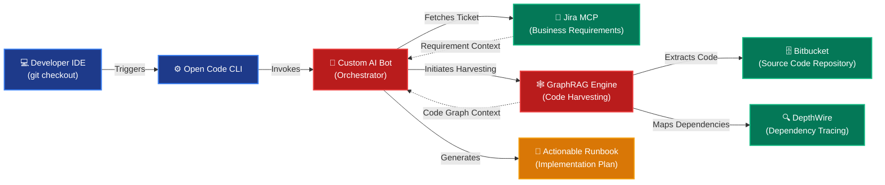

This is a very smart pivot. If your colleagues are going to show the *mechanics* (the "how"), you absolutely do not want to steal their thunder or bore the audience by explaining the exact same steps right before they show them.
Since you have 5 minutes of speaking time across a 20-minute session, your role as the presenter is to focus on the **"Why"** and the **"Value."** You need to act as the strategic voice: explaining the business problem, the architectural benefit, and the time saved, before passing the baton to your colleagues to show it in action.
Here is the newly revised, high-level structure. The slides and your speaker notes are now focused on **Impact, Efficiency, and Strategy**.
### **Slide 1: Title Slide**
 * **Title:** Intelligent SDLC Automation
 * **Subtitle:** Accelerating Delivery & Quality from Analysis to Documentation
 * **Visual:** High-level pipeline graphic.
**Speaker Notes (The Setup):**
> "Hello everyone. Today we are going to showcase how our team has transformed our SDLC. We have 20 minutes today, and we want to spend most of that time showing you real, working software. I’ll be framing the strategic value of our automations, and my colleagues in Mumbai and Chennai will follow up with live lightning demos for each phase."
> 
### **Slide 2: The Automation Philosophy**
 * **Bullets:**
   * Eliminate Cognitive Overload
   * Shift-Left on Quality
   * Zero-Friction Developer Experience
**Speaker Notes (The Strategy):**
> "Our core philosophy was simple: developers should spend time solving complex business problems, not doing repetitive setup or administrative tasks. We targeted four phases—Analysis, Development, Review, and Documentation—to remove friction, enforce clean code standards automatically, and keep the 'human-in-the-loop' only where their expertise is truly needed."
> 
### **Slide 3: Phase 1 - AI-Driven Impact Analysis**
 * **Bullets:**
   * **The Problem:** Manual dependency tracing is slow and prone to blind spots.
   * **The Solution:** Instant, AI-driven context harvesting.
   * **The Value:** Developers start with a validated execution plan, eliminating day-one ambiguity.
**Speaker Notes (The Value Proposition & Handoff):**
> "Starting with the Analysis phase. Historically, figuring out the exact impact of a new Jira ticket required hours of manual code tracing and domain knowledge. We automated this so that our systems analyze the requirements and the codebase simultaneously, generating a clear runbook before a single line of code is written.
> **[HANDOFF]:** To show you how fast a developer goes from picking up a ticket to having a complete implementation plan, I’ll hand it over to **[Colleague 1]**."
> *(Demo)*
> **[TAKEBACK]:** "Thanks, **[Colleague 1]**. Now let's look at the actual coding phase."
> 
### **Slide 4: Phase 2 - AI-Assisted Development**
 * **Bullets:**
   * **The Problem:** Writing unit tests is often treated as a chore rather than a design exercise.
   * **The Solution:** AI-proposed test designs with human validation.
   * **The Value:** Higher quality assertions, faster coding velocity, and robust test coverage without the fatigue.
**Speaker Notes (The Value Proposition & Handoff):**
> "In development, our biggest win has been transforming how we handle unit testing. We didn’t just automate test creation; we automated test *design*. By forcing a human approval step on the test design itself, we ensure we are testing the right logic, not just chasing coverage metrics.
> **[HANDOFF]:** Over to **[Colleague 2]** to show how this intelligent generation accelerates our development cycles."
> *(Demo)*
> **[TAKEBACK]:** "Thanks, **[Colleague 2]**. With the code written and tested, we move to the review."
> 
### **Slide 5: Phase 3 - Automated PR & Code Review Workflow**
 * **Bullets:**
   * **The Problem:** Human reviewers bottleneck on basic syntax and standard enforcement.
   * **The Solution:** First-pass AI code reviews.
   * **The Value:** Human reviewers focus purely on architecture and complex logic, drastically reducing PR cycle times.
**Speaker Notes (The Value Proposition & Handoff):**
> "Code reviews are critical, but having senior engineers point out basic standard violations is a waste of their time. We introduced an automated first-pass review bot. By the time a human reviewer looks at a pull request, the baseline issues have already been triaged and resolved by the developer and the bot.
> **[HANDOFF]:** Let’s look at this automated feedback loop in action. Over to **[Colleague 3]**."
> *(Demo)*
> **[TAKEBACK]:** "Thanks, **[Colleague 3]**. Finally, let's talk about the hardest part of any release: keeping the documentation alive."
> 
### **Slide 6: Phase 4 - Self-Sustaining Technical Documentation**
 * **Bullets:**
   * **The Problem:** Documentation is instantly outdated the moment code is merged.
   * **The Solution:** Automated, delta-based master document updates.
   * **The Value:** A living, single source of truth with zero manual maintenance overhead.
**Speaker Notes (The Value Proposition & Handoff):**
> "Technical debt often takes the form of outdated documentation. We automated our documentation phase so that our Master Documents update themselves based on the actual changes merged in the PR. If a change is significant, the system intelligently captures it, ensuring our knowledge base is always a living source of truth.
> **[HANDOFF]:** I’ll hand it back to **[Colleague Name]** for our final demo to show how this updates seamlessly."
> *(Demo)*
> **[TAKEBACK]:** "Thank you."
> 
### **Slide 7: Conclusion & Q&A**
**Speaker Notes:**
> "By tackling these four phases, we’ve successfully shifted left on quality and drastically reduced manual overhead. Thank you to the team for the demos, and thank you all for your time. We’d love to answer any questions you have."
> 
By keeping your talking points focused entirely on **"The Problem vs. The Value"**, you perfectly set the stage for your colleagues. Does this strategic approach feel like a better fit for your 5-minute speaking slot?

That is a fantastic level of detail to add. Highlighting **GraphRAG** (Graph Retrieval-Augmented Generation) alongside **DepthWire** and **Bitbucket** elevates this from a standard automation talk to a highly advanced AI engineering showcase.
Here is the **Mermaid script** for your architecture diagram. You can copy and paste this directly into any Mermaid-supported tool (like Draw.io, Notion, GitHub, or a Mermaid-to-PPT plugin) to instantly generate a clean, professional flowchart.
### **The Architecture Diagram (Mermaid Script)**

### **Updated Speaker Notes for Slide 3 (Incorporating GraphRAG & DepthWire)**
Here is how you can narrate this architecture flawlessly within your 5-minute time limit.
**Speaker Notes (The Architecture & Handoff):**
> "Starting with the Analysis phase. Historically, understanding the full impact of a Jira ticket required manual code tracing, which is slow and error-prone. To solve this, we built a highly advanced, event-driven AI bot.
> If you look at the architecture on the screen, the entire process kicks off the moment a developer does a git checkout, triggering our Open Code CLI. Our AI bot acts as the orchestrator. First, it uses the Jira MCP to pull the exact business requirements.
> But the real magic happens in the code harvesting. We use a **GraphRAG** engine to intelligently map our codebase. The GraphRAG pulls the raw source code from **Bitbucket** and cross-references it with **DepthWire** to trace all hidden dependencies.
> The bot merges the Jira requirements with this deep GraphRAG context to generate a highly accurate, step-by-step Runbook. Before writing a single line of code, the developer has a fully validated implementation plan.
> **[HANDOFF]:** To show you this GraphRAG and code harvesting in real-time, I’ll hand it over to **[Colleague 1]** for the demo."
> 
This script positions you as the architectural visionary. It seamlessly explains the "how" (GraphRAG, DepthWire, Bitbucket) while letting your colleague handle the "show."

